---
## Front matter
title: "Отчет по лабораторной работе № 2"
subtitle: "дисциплина:	Архитектура компьютера"
author: "Самойлова Софья Дмитриевна"

## Generic otions
lang: ru-RU
toc-title: "Содержание"

## Bibliography
bibliography: bib/cite.bib
csl: pandoc/csl/gost-r-7-0-5-2008-numeric.csl

## Pdf output format
toc: true # Table of contents
toc-depth: 2
lof: true # List of figures
lot: true # List of tables
fontsize: 12pt
linestretch: 1.5
papersize: a4
documentclass: scrreprt
## I18n polyglossia
polyglossia-lang:
  name: russian
  options:
	- spelling=modern
	- babelshorthands=true
polyglossia-otherlangs:
  name: english
## I18n babel
babel-lang: russian
babel-otherlangs: english
## Fonts
mainfont: IBM Plex Serif
romanfont: IBM Plex Serif
sansfont: IBM Plex Sans
monofont: IBM Plex Mono
mathfont: STIX Two Math
mainfontoptions: Ligatures=Common,Ligatures=TeX,Scale=0.94
romanfontoptions: Ligatures=Common,Ligatures=TeX,Scale=0.94
sansfontoptions: Ligatures=Common,Ligatures=TeX,Scale=MatchLowercase,Scale=0.94
monofontoptions: Scale=MatchLowercase,Scale=0.94,FakeStretch=0.9
mathfontoptions:
## Biblatex
biblatex: true
biblio-style: "gost-numeric"
biblatexoptions:
  - parentracker=true
  - backend=biber
  - hyperref=auto
  - language=auto
  - autolang=other*
  - citestyle=gost-numeric
## Pandoc-crossref LaTeX customization
figureTitle: "Рис."
tableTitle: "Таблица"
listingTitle: "Листинг"
lofTitle: "Список иллюстраций"
lotTitle: "Список таблиц"
lolTitle: "Листинги"
## Misc options
indent: true
header-includes:
  - \usepackage{indentfirst}
  - \usepackage{float} # keep figures where there are in the text
  - \floatplacement{figure}{H} # keep figures where there are in the text
---

# Цель работы

Целью работы является изучить идеологию и применение средств контроля версий, а также приобрести практические навыки по работе с системой git

# Теоретическое введение

Системы контроля версий (VCS) используются для совместной работы над проектами. Обычно основное дерево проекта хранится в локальном или удалённом репозитории с доступом для участников. VCS фиксирует изменения, объединяет их и позволяет откатываться к предыдущим версиям.
 В классических системах применяется централизованная модель с единственным репозиторием, где сервер управляет версиями. Пользователь получает нужную версию файлов, вносит изменения и загружает новую версию, при этом старые версии сохраняются. Сервер может использовать дельта-компрессию, сохраняя только изменения между версиями, что позволяет уменьшить объём хранимых
данных.
 Системы контроля версий предлагают гибкие функции, такие как поддержка нескольких версий одного файла с сохранением общей истории изменений и индивидуальных ветвей. Они фиксируют информацию о том, кто и когда вносил изменения, что хранится в журнале, доступ к которому можно ограничить. В распределённых системах центральный репозиторий не обязателен. Из классических VCS известны CVS и Subversion, а среди распределённых — Git, Bazaar и Mercurial. Принципы их работы схожи, различия в синтаксисе команд.

 Система контроля версий Git представляет собой набор программ командной строки.
Доступ к ним можно получить из терминала посредством ввода команды git с различными опциями. 
 Благодаря тому, что Git является распределённой системой контроля версий, резервную копию локального хранилища можно сделать простым копированием или архивацией.

# Выполнение лабораторной работы

1. Базовая настройка git
Существует несколько доступных серверов репозиториев с возможностью бесплатного размещения данных. Например, http://bitbucket.org/, https://github.com/ и https://gitflic.ru. Для выполнения лабораторных работ предлагается использовать Github.
 Создаем учётную запись на сайте https://github.com/ и заполняем основные данные (рис.[-@fig:001]).

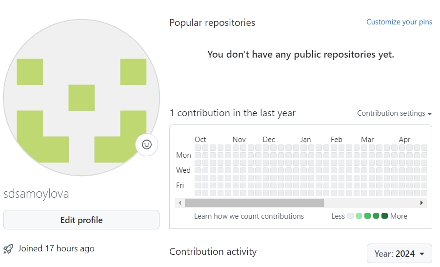{#fig:001 width=70%}

Сделаем предварительную конфигурацию git. Откроем терминал и введем
следующие команды, указав имя и email владельца репозитория (рис.[-@fig:002]).

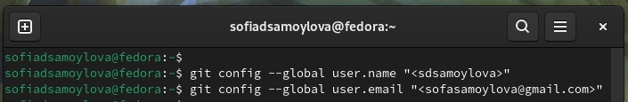{#fig:002 width=70%}

Настроим utf-8 в выводе сообщений git ((рис.[-@fig:003]).

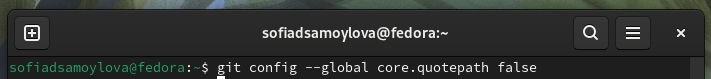{#fig:003 width=70%}

Зададим имя начальной ветки (будем называть её master) (рис.[-@fig:004]).

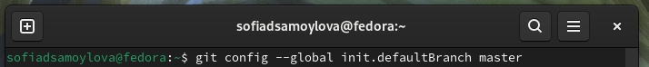{#fig:004 width=70%}

Параметр autocrlf и safecrlf (рис.[-@fig:005]).

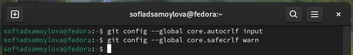{#fig:005 width=70%}

2. Создание SSH ключа
Для последующей идентификации пользователя на сервере репозиториев необходимо
сгенерировать пару ключей (приватный и открытый) (рис.[-@fig:006]).

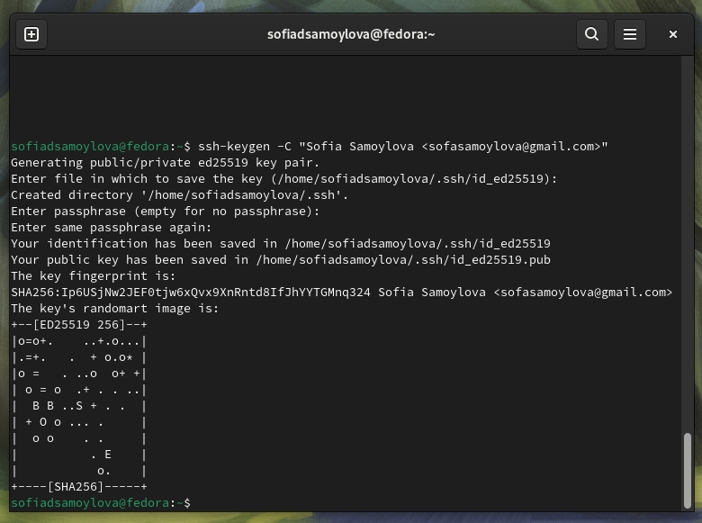{#fig:006 width=70%}

Xclip – утилита, позволяющая скопировать любой текст через терминал. Оказывается, в дистрибутиве Linux Kali ее сначала надо установить. Устанавливаю
xclip с помощью команды apt-get install с ключом -y от имени суперпользователя,
введя в начале команды sudo (рис.[-@fig:007]).

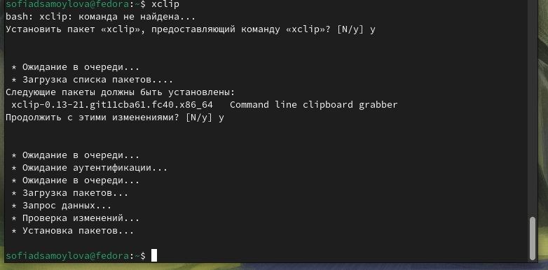{#fig:007 width=70%}

Ключи сохранятся в каталоге ~/.ssh/.
Далее необходимо загрузить сгенерённый открытый ключ. Для этого заходим на сайт http://github.org/ под своей учётной записью и переходим в меню Setting. После этого выбрать в боковом меню SSH and GPG keys и нажать кнопку New SSH key, скопировав из локальной консоли ключ в буфер обмена и вставляем ключ в появившееся на сайте поле и указываем для ключа имя (Title) (рис.[-@fig:008]).

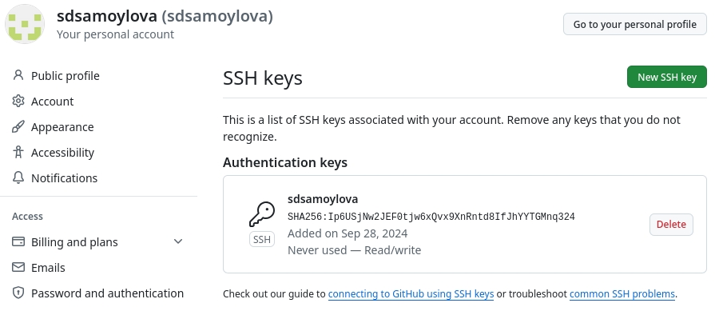{#fig:008 width=70%}

3. Создание рабочего пространства и репозитория курса на основе шаблона
При выполнении лабораторных работ следует придерживаться структуры рабочего пространства.
Название проекта на хостинге git имеет вид: study_<учебный год>_<код предмета>
Например, для 2023–2024 учебного года и предмета «Архитектура компьютера» (код предмета arch-pc) название проекта примет следующий вид: study_2023–2024_arch-pc

Открываем терминал и создаем каталог для предмета «Архитектура компьютера»:mkdir -p ~/work/study/2024-2025/"Архитектура компьютера" (рис.[-@fig:009]).

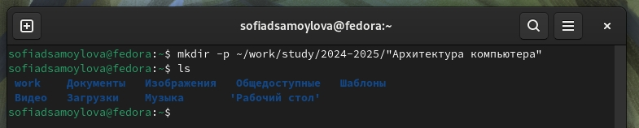{#fig:009 width=70%}

Репозиторий на основе шаблона можно создать через web-интерфейс github. Переходим на станицу репозитория с шаблоном курса
https://github.com/yamadharma/course-directory-student-template 
(рис.[-@fig:010]).

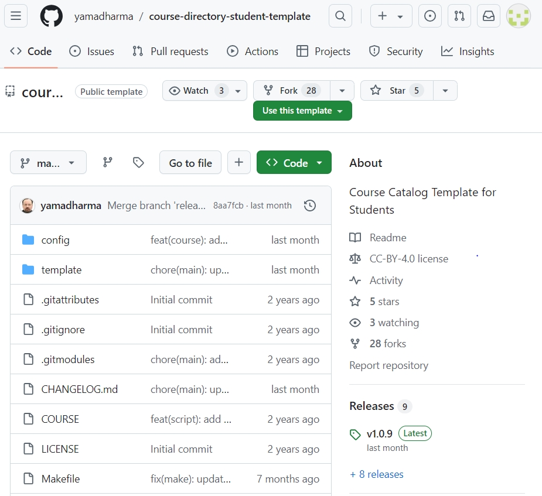{#fig:010 width=70%}

Далее выбираем Use this template.

В открывшемся окне задаем имя репозитория (Repository name) study_2024–2025_arсh-pc и создаем репозиторий (кнопка Create repository from template).(рис.[-@fig:011]).

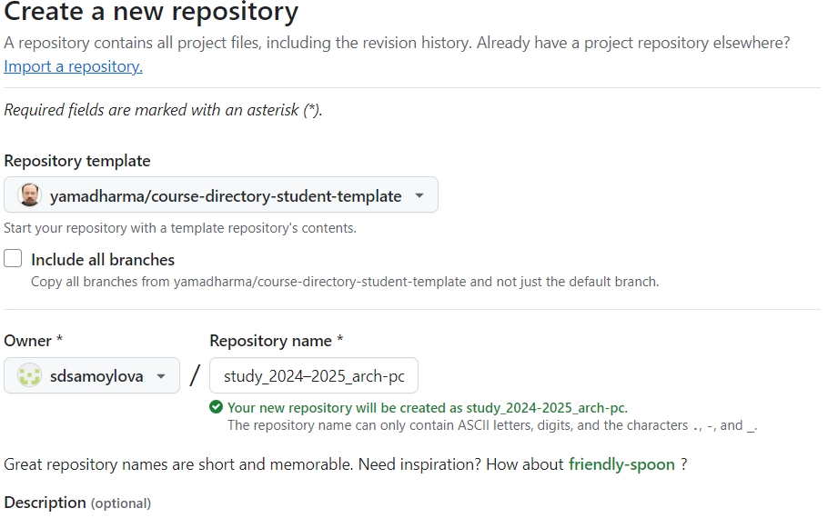{#fig:011 width=70%}

Открываем терминал, переходим в каталог курса и клонируем созданный репозиторий (рис.[-@fig:012]).

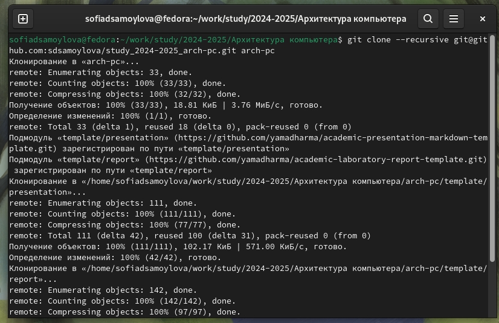{#fig:012 width=70%}

4. Настройка каталога курса
Переходим в каталог курса и удаляем лишние файлы (рис.[-@fig:013]).

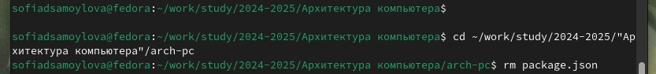{#fig:013 width=70%}

Создаем необходимые каталоги (рис.[-@fig:014]).

{#fig:014 width=70%}

# Выводы

 При выполнении данной лабораторной работы я изучила идеологию и применение средств контроля версий, а также приобрела практические навыки по работе с системой git.

# Список литературы{.unnumbered}

1. GDB: The GNU Project Debugger. — URL: https://www.gnu.org/software/gdb/.
2. GNU Bash Manual. — 2016. — URL: https://www.gnu.org/software/bash/manual/.
3. Midnight Commander Development Center. — 2021. — URL: https://midnight-commander.org/.
4. NASM Assembly Language Tutorials. — 2021. — URL: https://asmtutor.com/.
5. Newham C. Learning the bash Shell: Unix Shell Programming. — O’Reilly Media, 2005. —354 с. — (In a Nutshell). — ISBN 0596009658. — URL: http://www.amazon.com/Learningbash-Shell-Programming-Nutshell/dp/0596009658.
6. Robbins A. Bash Pocket Reference. — O’Reilly Media, 2016. — 156 с. — ISBN 978-1491941591.
7. The NASM documentation. — 2021. — URL: https://www.nasm.us/docs.php.
8. Zarrelli G. Mastering Bash. — Packt Publishing, 2017. — 502 с. — ISBN 9781784396879.
9. Колдаев В. Д., Лупин С. А. Архитектура ЭВМ. — М. : Форум, 2018.
10. Куляс О. Л., Никитин К. А. Курс программирования на ASSEMBLER. — М. : Солон-Пресс,2017.
11. Новожилов О. П. Архитектура ЭВМ и систем. — М. : Юрайт, 2016.
12. Расширенный ассемблер: NASM. — 2021. — URL: https://www.opennet.ru/docs/RUS/nasm/.
13. Робачевский А., Немнюгин С., Стесик О. Операционная система UNIX. — 2-е изд. — БХВПетербург, 2010. — 656 с. — ISBN 978-5-94157-538-1.
14. Столяров А. Программирование на языке ассемблера NASM для ОС Unix. — 2-е изд. —М. : МАКС Пресс, 2011. — URL: http://www.stolyarov.info/books/asm_unix.
15. Таненбаум Э. Архитектура компьютера. — 6-е изд. — СПб. : Питер, 2013. — 874 с. —(Классика Computer Science).
16. Таненбаум Э., Бос Х. Современные операционные системы. — 4-е изд. — СПб. : Питер, 2015. — 1120 с. — (Классика Computer Science). 
