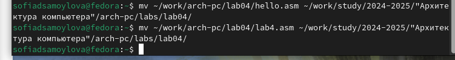
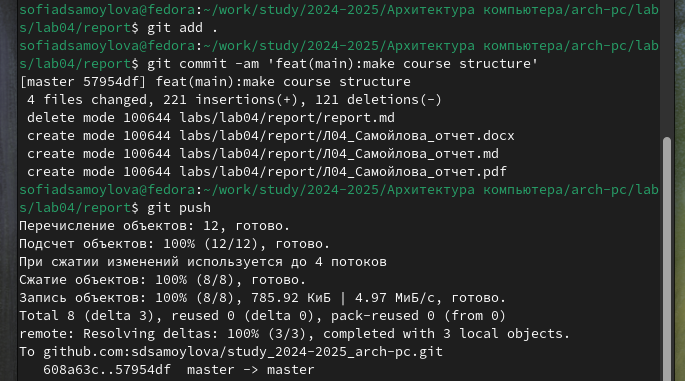

---
## Front matter
title: "Отчёт по лабораторной работе №4"
subtitle: "Дисциплина: архитектура компьютера"
author: "Самойлова Софья Дмитриевна"

## Generic otions
lang: ru-RU
toc-title: "Содержание"

## Bibliography
bibliography: bib/cite.bib
csl: pandoc/csl/gost-r-7-0-5-2008-numeric.csl

## Pdf output format
toc: true # Table of contents
toc-depth: 2
lof: true # List of figures
lot: true # List of tables
fontsize: 12pt
linestretch: 1.5
papersize: a4
documentclass: scrreprt
## I18n polyglossia
polyglossia-lang:
  name: russian
  options:
	- spelling=modern
	- babelshorthands=true
polyglossia-otherlangs:
  name: english
## I18n babel
babel-lang: russian
babel-otherlangs: english
## Fonts
mainfont: IBM Plex Serif
romanfont: IBM Plex Serif
sansfont: IBM Plex Sans
monofont: IBM Plex Mono
mathfont: STIX Two Math
mainfontoptions: Ligatures=Common,Ligatures=TeX,Scale=0.94
romanfontoptions: Ligatures=Common,Ligatures=TeX,Scale=0.94
sansfontoptions: Ligatures=Common,Ligatures=TeX,Scale=MatchLowercase,Scale=0.94
monofontoptions: Scale=MatchLowercase,Scale=0.94,FakeStretch=0.9
mathfontoptions:
## Biblatex
biblatex: true
biblio-style: "gost-numeric"
biblatexoptions:
  - parentracker=true
  - backend=biber
  - hyperref=auto
  - language=auto
  - autolang=other*
  - citestyle=gost-numeric
## Pandoc-crossref LaTeX customization
figureTitle: "Рис."
tableTitle: "Таблица"
listingTitle: "Листинг"
lofTitle: "Список иллюстраций"
lotTitle: "Список таблиц"
lolTitle: "Листинги"
## Misc options
indent: true
header-includes:
  - \usepackage{indentfirst}
  - \usepackage{float} # keep figures where there are in the text
  - \floatplacement{figure}{H} # keep figures where there are in the text
---
# Цель работы

Цель данной лабораторной работы - освоить процедуры компиляции и сборки программ, написанных на ассемблере NASM.

# Задание

1. Программа Hello world!
2. Транслятор NASM
3. Расширенный синтаксис командной строки NASM
4. Компоновщик LD
5. Запуск исполняемого файла
6. Выполнение заданий для самостоятельной работы.

# Теоретическое введение

Основными функциональными элементами любой ЭВМ являются центральный процессор, память и периферийные устройства. Взаимодействие этих
устройств осуществляется через общую шину, к которой они подключены.
Физически шина представляет собой большое количество проводников,
соединяющих устройства друг с другом. В современных компьютерах проводники выполнены в виде электропроводящих дорожек на материнской
плате. Основной задачей процессора является обработка информации, а также
организация координации всех узлов компьютера. В состав центрального
процессора входят следующие устройства: - арифметико-логическое устройство
(АЛУ) — выполняет логические и арифметические действия, необходимые
для обработки информации, хранящейся в памяти; - устройство управления
(УУ) — обеспечивает управление и контроль всех устройств компьютера; -
регистры — сверхбыстрая оперативная память небольшого объёма, входящая
в состав процессора, для временного хранения промежуточных результатов
выполнения инструкций; регистры процессора делятся на два типа: регистры
общего назначения и специальные регистры. Для того, чтобы писать программы
на ассемблере, необходимо знать, какие регистры процессора существуют и
как их можно использовать. Большинство команд в программах написанных
на ассемблере используют регистры в каче- стве операндов. Практически все
команды представляют собой преобразование данных хранящихся в регистрах
процессора, это например пересылка данных между регистрами или между
регистрами и памятью, преобразование (арифметические или логические операции) данных хранящихся в регистрах. Доступ к регистрам осуществляется
не по адресам, как к основной памяти, а по именам. Каждый регистр процессора
архитектуры x86 имеет свое название, состоящее из 2 или 3 букв латинского
алфавита. В качестве примера приведем названия основных регистров общего
назначения (именно эти регистры чаще всего используются при написании
программ): - RAX, RCX, RDX, RBX, RSI, RDI — 64-битные - EAX, ECX, EDX, EBX, ESI,
EDI — 32-битные - AX, CX, DX, BX, SI, DI — 16-битные - AH, AL, CH, CL, DH, DL, BH,
BL — 8-битные
Другим важным узлом ЭВМ является оперативное запоминающее устройство (ОЗУ). ОЗУ — это быстродействующее энергозависимое запоминающее устройство, которое напрямую взаимодействует с узлами процессора, предназначенное
для хранения программ и данных, с которыми процессор непосредственно работает в текущий момент. ОЗУ состоит из одинаковых пронумерованных ячеек
памяти. Номер ячейки памяти — это адрес хранящихся в ней данных. Периферийные устройства в составе ЭВМ: - устройства внешней памяти, которые предназначены для долговременного хранения больших объёмов данных. - устройства
ввода-вывода, которые обеспечивают взаимодействие ЦП с внешней средой.
В основе вычислительного процесса ЭВМ лежит принцип программного управления. Это означает, что компьютер решает поставленную задачу как последовательность действий, записанных в виде программы.
Коды команд представляют собой многоразрядные двоичные комбинации из
0 и 1. В коде машинной команды можно выделить две части: операционную
и адресную. В операционной части хранится код команды, которую необходимо выполнить. В адресной части хранятся данные или адреса данных, которые
участвуют в выполнении данной операции. При выполнении каждой команды
процессор выполняет определённую последовательность стандартных действий,
которая называется командным циклом процессора. Он заключается в следующем: 1. формирование адреса в памяти очередной команды; 2. считывание
кода команды из памяти и её дешифрация; 3. выполнение команды; 4. переход к следующей команде.
Язык ассемблера (assembly language, сокращённо asm) — машинно-ориентированный язык низкого уровня. NASM — это открытый проект
ассемблера, версии которого доступны под различные операционные системы
и который позволяет получать объектные файлы для этих систем. В NASM
используется Intel-синтаксис и поддерживаются инструкции x86-64

# Выполнение лабораторной работы
## Программа Hello world!
Рассмотрим пример простой программы на языке ассемблера NASM. Традиционно первая
программа выводит приветственное сообщение Hello world! на экран.
Создаём каталог для работы с программами на языке ассемблера NASM, переходим в созданный каталог и создаем текстовый файл с именем hello.asm (рис. [-@fig:001]).

{#fig:001 width=70%}

Открываем этот файл с помощью любого текстового редактора, например, gedit и вводим в него код (рис. [-@fig:002]):

{#fig:002 width=70%}

Важно: в отличие от многих современных высокоуровневых языков программирования, в ассемблерной программе каждая команда располагается на отдельной строке. Размещение
нескольких команд на одной строке недопустимо. Синтаксис ассемблера NASM является
чувствительным к регистру, т.е. есть разница между большими и малыми буквами.

## Транслятор NASM
NASM превращает текст программы в объектный код. Например, для компиляции приведённого выше текста программы «Hello World» необходимо написать:

```bash
nasm -f elf hello.asm
```

Если текст программы набран без ошибок, то транслятор преобразует текст программы
из файла `hello.asm` в объектный код, который запишется в файл hello.o. Таким образом,
имена всех файлов получаются из имени входного файла и расширения по умолчанию.
При наличии ошибок объектный файл не создаётся, а после запуска транслятора появятся
сообщения об ошибках или предупреждения.
С помощью команды ls проверяем, что объектный файл был создан. Объектный файл был назван `hello.o` (рис. [-@fig:003]):

{#fig:003 width=70%}

NASM не запускают без параметров. Ключ -f указывает транслятору, что требуется создать
бинарные файлы в формате ELF. Следует отметить, что формат elf64 позволяет создавать
исполняемый код, работающий под 64-битными версиями Linux. Для 32-битных версий ОС
указываем в качестве формата просто elf.
NASM всегда создаёт выходные файлы в текущем каталоге

## Расширенный синтаксис командной строки NASM

Полный вариант командной строки nasm выглядит следующим образом:
```
nasm [-@ косвенный_файл_настроек] [-o объектный_файл] [-f формат_объектного_файла] [-l листинг] [параметры...] [--] исходный_файл
```
Выполняем следующую команду и с помощью команды `ls` проверяем, что файлы были созданы.(рис. [-@fig:004]):
```bash
nasm -o obj.o -f elf -g -l list.lst hello.asm
```

{#fig:004 width=70%}

Данная команда скомпилирует исходный файл hello.asm в obj.o (опция -o позволяет
задать имя объектного файла, в данном случае obj.o), при этом формат выходного файла
будет elf, и в него будут включены символы для отладки (опция -g), кроме того, будет создан
файл листинга list.lst (опция -l).

## Компоновщик LD

Чтобы получить исполняемую программу, объектный файл передаем на обработку компоновщику и с помощью команды ls проверяем, что исполняемый файл hello был создан (рис. [-@fig:005]):

{#fig:005 width=70%}

## Запуск исполняемого файла

Запустим на выполнение созданный исполняемый файл, находящийся в текущем каталоге, набрав в командной строке: (рис. [-@fig:006]):
./hello 

{#fig:006 width=70%}

# Выполнение самостоятельной работы
В каталоге ~/work/arch-pc/lab04 с помощью команды cp создаю копию файла hello.asm с именем lab4.asm (рис. [-@fig:007]):

{#fig:007 width=70%}

Вношу изменения в текст программы в файле lab4.asm так, чтобы вместо Hello world! на экран выводилась строка с моими фамилией и именем (рис. [-@fig:008]):

{#fig:008 width=70%}

Транслирую полученный текст программы lab4.asm в объектный файл. Выполняю компоновку объектного файла и запускаю получившийся исполняемый файл.(рис. [-@fig:009]):

{#fig:009 width=70%}

(рис. [-@fig:010]):

{#fig:010 width=70%}

Копирую файлы hello.asm и lab4.asm в свой локальный репозиторий в каталог ~/work/study/2024-2025/"Архитектура компьютера"/arch-pc/labs/lab04/ (рис. [-@fig:011]):

{#fig:011 width=70%}

Загружаю файлы на Github (рис. [-@fig:012]):

{#fig:012 width=70%}


# Выводы

Я освоила процедуры оформления отчетов с помощью легковесного языка разметки Markdown

