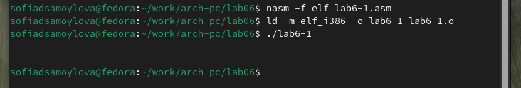

---
## Front matter
title: "Отчёт по лабораторной работе №6"
subtitle: "Дисциплина: Архитектура компьютера"
author: "Самойлова Софья Дмитриевна"

## Generic otions
lang: ru-RU
toc-title: "Содержание"

## Bibliography
bibliography: bib/cite.bib
csl: pandoc/csl/gost-r-7-0-5-2008-numeric.csl

## Pdf output format
toc: true # Table of contents
toc-depth: 2
lof: true # List of figures
fontsize: 12pt
linestretch: 1.5
papersize: a4
documentclass: scrreprt
## I18n polyglossia
polyglossia-lang:
  name: russian
  options:
	- spelling=modern
	- babelshorthands=true
polyglossia-otherlangs:
  name: english
## I18n babel
babel-lang: russian
babel-otherlangs: english
## Fonts
mainfont: IBM Plex Serif
romanfont: IBM Plex Serif
sansfont: IBM Plex Sans
monofont: IBM Plex Mono
mathfont: STIX Two Math
mainfontoptions: Ligatures=Common,Ligatures=TeX,Scale=0.94
romanfontoptions: Ligatures=Common,Ligatures=TeX,Scale=0.94
sansfontoptions: Ligatures=Common,Ligatures=TeX,Scale=MatchLowercase,Scale=0.94
monofontoptions: Scale=MatchLowercase,Scale=0.94,FakeStretch=0.9
mathfontoptions:
## Biblatex
biblatex: true
biblio-style: "gost-numeric"
biblatexoptions:
  - parentracker=true
  - backend=biber
  - hyperref=auto
  - language=auto
  - autolang=other*
  - citestyle=gost-numeric
## Pandoc-crossref LaTeX customization
figureTitle: "Рис."
lofTitle: "Список иллюстраций"
## Misc options
indent: true
header-includes:
  - \usepackage{indentfirst}
  - \usepackage{float} # keep figures where there are in the text
  - \floatplacement{figure}{H} # keep figures where there are in the text
---

# Цель работы

Цель данной лабораторной работы - освоение арифметических инструкций языка ассемблера `NASM`.

# Задание

1. Символьные и численные данные в `NASM`
2. Выполнение арифметических операций в `NASM`
3. Ответы на вопросы
4. Выполнение заданий для самостоятельной работы

# Теоретическое введение

Большинство инструкций на языке ассемблера требуют обработки операндов. Адрес операнда предоставляет место, где хранятся данные, подлежащие обработке. Это могут быть данные хранящиеся в регистре или в ячейке памяти.

- Регистровая адресация – операнды хранятся в регистрах и в команде используются имена этих регистров, например: `mov ax,bx`.
- Непосредственная адресация – значение операнда задается непосредственно в команде, Например: `mov ax,2`.
- Адресация памяти – операнд задает адрес в памяти. В команде указывается символическое обозначение ячейки памяти, над содержимым которой требуется выполнить операцию.

Ввод информации с клавиатуры и вывод её на экран осуществляется в символьном виде. Кодирование этой информации производится согласно кодовой таблице символов `ASCII`. `ASCII` – сокращение от *American Standard Code for Information Interchange* (Американский стандартный код для обмена информацией). Согласно стандарту `ASCII` каждый символ кодируется одним байтом. Среди инструкций `NASM` нет такой, которая выводит числа (не в символьном виде). Поэтому, например, чтобы вывести число, надо предварительно преобразовать его цифры в `ASCII`-коды этих цифр и выводить на экран эти коды, а не само число. Если же выводить число на экран непосредственно, то экран воспримет его не как число, а как последовательность `ASCII`-символов – каждый байт числа будет воспринят как один `ASCII`-символ – и выведет на экран эти символы. Аналогичная ситуация происходит и при вводе данных с клавиатуры. Введенные данные будут представлять собой символы, что сделает невозможным получение корректного результата при выполнении над ними арифметических операций. Для решения этой проблемы необходимо проводить преобразование `ASCII` символов в числа и обратно.

# Выполнение лабораторной работы
## Символьные и численные данные в NASM

С помощью утилиты `mkdir` создаю директорию, в которой буду создавать файлы с программами для лабораторной работы №7. Перехожу в созданный каталог с помощью утилиты `cd` и создаю файл `lab6-1.asm` (рис. [-@fig:001]).

{#fig:001 width=70%}

Копирую в текущий каталог файл `in_out.asm` с помощью утилиты `cp`, т.к. он будет использоваться в других программах (рис. [-@fig:002]).

{#fig:002 width=70%}

Открываю созданный файл `lab6-1.asm`, вставляю в него программу вывода значения регистра `eax`, создаю исполняемый файл программы и запускаю его (рис. [-@fig:003]).

{#fig:003 width=70%}

Вывод программы: символ `j`, потому что программа вывела символ, соответствующий по системе `ASCII` сумме двоичных кодов символов 4 и 6.

Изменяю в тексте программы символы "6" и "4" на цифры 6 и 4 (рис. [-@fig:004]). 

{#fig:004 width=70%}

Создаю новый исполняемый файл программы и запускаю его (рис. [-@fig:005]). Теперь вывелся символ с кодом 10, это символ перевода строки, этот символ не отображается при выводе на экран.

{#fig:005 width=70%}

Создаю новый файл `lab6-2.asm` с помощью утилиты `touch`и ввожу в файл текст другой программы для вывода значения регистра `eax` (рис. [-@fig:006]).

{#fig:006 width=70%}

Создаю и запускаю исполняемый файл `lab6-2` (рис. [-@fig:007]). Теперь вывод число 106, что является результатом сложения кодов символов "6" и "4".

{#fig:007 width=70%}

Заменяю в тексте программы в файле `lab6-2.asm` символы "6" и "4" на числа 6 и 4(рис. [-@fig:008]).

{#fig:008 width=70%}

Создаю и запускаю новый исполняемый файл (рис. [-@fig:009]). Теперь программа складывает не соответствующие символам коды в системе `ASCII`, а сами числа, поэтому вывод 10.

{#fig:009 width=70%}

Заменяю в тексте программы функцию `iprintLF` на `iprint`(рис. [-@fig:010]).

{#fig:010 width=70%}

Создаю и запускаю новый исполняемый файл (рис. [-@fig:011]). Вывод не изменился, потому что символ переноса строки не отображался, когда программа исполнялась с функцией `iprintLF`, а `iprint` не добавляет к выводу символ переноса строки, в отличие от `iprintLF`.

{ #fig:011 width=70% }

## Выполнение арифметических операций в NASM

Создаю файл `lab6-3.asm` с помощью утилиты `touch` и ввожу в созданный файл текст программы для вычисления значения выражения *f(x) = (5 * 2 + 3)/3* (рис. [-@fig:012]).

{ #fig:012 width=70% }

Создаю исполняемый файл и запускаю его (рис. [-@fig:013]).

{ #fig:013 width=70% }

Изменяю программу так, чтобы она вычисляла значение выражения *f(x) = (4 * 6 + 2)/5* (рис. [-@fig:014]). 

{ #fig:014 width=70% }

Создаю исполняемый файл и проверяю его работу (рис. [-@fig:015]). 

{ #fig:015 width=70% }

Создаю файл `variant.asm` в каталоге `~/work/arch-pc/lab06`, ввожу текст программы вычисления варианта задания по номеру студенческого билета, создаю исполняемый файл и запускаю его (рис. [-@fig:016]). 

{ #fig:016 width=70% }

## Ответы на вопросы

1. За вывод сообщения "Ваш вариант" отвечают строки кода:

```NASM
mov eax,rem
call sprint
```
2. `mov ecx, x` используется, чтобы положить адрес вводимой строки `x` в регистр `ecx`
`mov edx, 80` - запись в регистр `edx` длины вводимой строки 
`call sread` - вызов подпрограммы из внешнего файла, обеспечивающей ввод сообщения с клавиатуры

3. `call atoi` используется для вызова подпрограммы из внешнего файла, которая преобразует `ascii`-код символа в целое число и записывает результат в регистр `eax`

4. За вычисления варианта отвечают строки:

```NASM
xor edx,edx ; обнуление edx для корректной работы div
mov ebx,20 ; ebx = 20
div ebx ; eax = eax/20, edx - остаток от деления
inc edx ; edx = edx + 1
```

5. При выполнении инструкции `div ebx` остаток от деления записывается в регистр `edx`

6. Инструкция `inc edx` увеличивает значение регистра `edx` на 1

7. За вывод на экран результатов вычислений отвечают строки:

```NASM
mov eax,edx
call iprintLF
```

## Выполнение заданий для самостоятельной работы

Программа для вычисления выражения варианта №17:

```NASM
;--------------------------------
; Программа вычисления выражения 18(x + 1)/6
;------------------------------
%include 'in_out.asm' ; подключение внешнего файла

SECTION .data ; секция инициированных данных
msg: DB 'Введите значение переменной x: ', 0
rem: DB 'Результат: ', 0

SECTION .bss ; секция не инициированных данных
x: RESB 80 ; Переменная, значение которой будем вводить с клавиатуры, выделенный размер - 80 байт

SECTION .text ; Код программы
GLOBAL _start ; Начало программы

_start: ; Точка входа в программу
    ; ---- Ввод значения x
    mov eax, msg ; запись адреса выводимого сообщения в eax
    call sprint ; вызов подпрограммы печати сообщения
    
    mov ecx, x ; запись адреса переменной в ecx
    mov edx, 80 ; запись длины вводимого значения в edx
    call sread ; вызов подпрограммы ввода сообщения
    
    mov eax, x ; вызов подпрограммы преобразования
    call atoi ; преобразование ASCII кода в число (eax = x)
    
    ; ---- Вычисление выражения 18(x + 1) / 6
    add eax, 1 ; eax = x + 1
    mov ebx, 18 ; запись значения 18 в ebx
    mul ebx ; EAX = EAX * EBX (EAX = 18 * (x + 1))
    
    mov ebx, 6 ; запись значения 6 в ebx для деления
    xor edx, edx ; обнуляем EDX для корректной работы div
    div ebx ; EAX = EAX / EBX (EAX = (18 * (x + 1)) / 6)

    ; ---- Вывод результата на экран
    mov edi, eax ; запись результата вычисления в 'edi'
    
    mov eax, rem ; вызов подпрограммы печати
    call sprint ; сообщение 'Результат: '
    
    mov eax, edi ; вызов подпрограммы печати значения
    call iprintLF ; из 'edi' в виде символов
    
    call quit ; вызов подпрограммы завершения
```

Создаю файл `lab6-4.asm` в каталоге `~/work/arch-pc/lab06`, вношу программу для вычисления выражения 18(x + 1)/6, создаю исполняемый файл и проверяю его работу для значений *х1 = 3* и *х2 = 1* (рис. [-@fig:017]). 

{ #fig:017 width=70% }


# Выводы

При выполнении данной лабораторной работы я освоила арифметические инструкции языка ассемблера `NASM`.
