---
## Front matter
title: "Отчёт по лабораторной работе №7"
subtitle: "Дисциплина: архитектура компьютера"
author: "Самойлова Софья Дмитриевна"

## Generic otions
lang: ru-RU
toc-title: "Содержание"

## Bibliography
bibliography: bib/cite.bib
csl: pandoc/csl/gost-r-7-0-5-2008-numeric.csl

## Pdf output format
toc: true # Table of contents
toc-depth: 2
lof: true # List of figures
fontsize: 12pt
linestretch: 1.5
papersize: a4
documentclass: scrreprt
## I18n polyglossia
polyglossia-lang:
  name: russian
  options:
	- spelling=modern
	- babelshorthands=true
polyglossia-otherlangs:
  name: english
## I18n babel
babel-lang: russian
babel-otherlangs: english
## Fonts
mainfont: IBM Plex Serif
romanfont: IBM Plex Serif
sansfont: IBM Plex Sans
monofont: IBM Plex Mono
mathfont: STIX Two Math
mainfontoptions: Ligatures=Common,Ligatures=TeX,Scale=0.94
romanfontoptions: Ligatures=Common,Ligatures=TeX,Scale=0.94
sansfontoptions: Ligatures=Common,Ligatures=TeX,Scale=MatchLowercase,Scale=0.94
monofontoptions: Scale=MatchLowercase,Scale=0.94,FakeStretch=0.9
mathfontoptions:
## Biblatex
biblatex: true
biblio-style: "gost-numeric"
biblatexoptions:
  - parentracker=true
  - backend=biber
  - hyperref=auto
  - language=auto
  - autolang=other*
  - citestyle=gost-numeric
## Pandoc-crossref LaTeX customization
figureTitle: "Рис."
lofTitle: "Список иллюстраций"
## Misc options
indent: true
header-includes:
  - \usepackage{indentfirst}
  - \usepackage{float} # keep figures where there are in the text
  - \floatplacement{figure}{H} # keep figures where there are in the text
---

# Цель работы

Целью лабораторной работы является изучение команд условного и безусловного переходов, приобретение навыков написания программ с использованием переходов, знакомство с назначением и структурой файла листинга.


# Задание
1. Реализация переходов в NASM
2. Изучение структуры файлы листинга
3. Задание для самостоятельной работы

# Теоретическое введение

Для реализации ветвлений в ассемблере используются так называемые команды передачи
управления или команды перехода. Можно выделить 2 типа переходов:

- *условный переход* – выполнение или не выполнение перехода в определенную точку
программы в зависимости от проверки условия.

- *безусловный переход* – выполнение передачи управления в определенную точку программы без каких-либо условий.


# Выполнение лабораторной работы
## Реализация переходов в NASM

С помощью утилиты `mkdir` создаю директорию, в которой буду создавать файлы с программами для лабораторной работы №7. Перехожу в созданный каталог с помощью утилиты `cd` и создаю файл `lab7-1.asm` (рис. [-@fig:001]). Дополнительно копирую в текущий каталог файл `in_out.asm` с помощью утилиты `cp`, т.к. он будет использоваться в других программах 

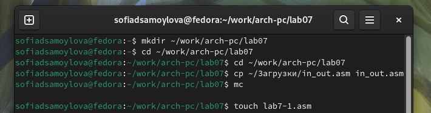{#fig:001 width=70%}

Инструкция `jmp` в `NASM` используется для реализации безусловных переходов. Рассмотрю пример программы с использованием инструкции `jmp`. Ввожу в файл `lab7-1.asm` текст программы (рис. [-@fig:002]).

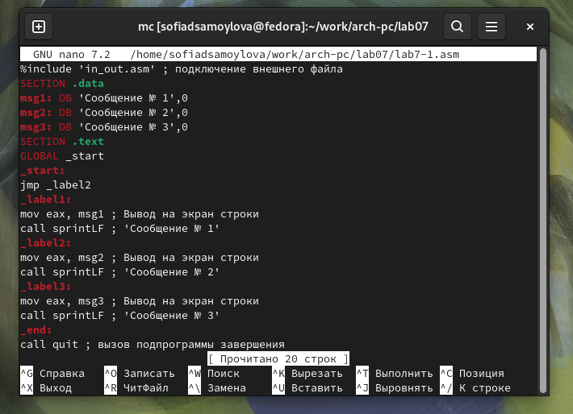{#fig:002 width=70%}

Создаю исполняемый файл и запускаю его. Результат работы данной программы следующий (рис. [-@fig:003]).

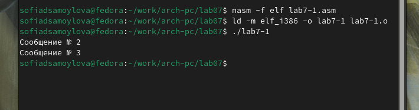{#fig:003 width=70%}

Таким образом, использование инструкции `jmp _label2` меняет порядок исполнения инструкций и позволяет выполнить инструкции начиная с метки `_label2`, пропустив вывод первого сообщения.

Изменяю программу таким образом, чтобы она выводила сначала `‘Сообщение № 2’`, потом `‘Сообщение № 1’` и завершала работу. Для этого в текст программы после вывода сообщения № 2 добавим инструкцию `jmp` с меткой `_label1` (т.е. переход к инструкциям вывода сообщения № 1) и после вывода сообщения № 1 добавим инструкцию `jmp` с меткой `_end` (т.е. переход к инструкции `call quit`) (рис. [-@fig:004]).

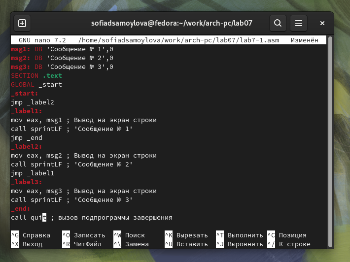{#fig:004 width=70%}

Создаю исполняемый файл и проверяю его работу (рис. [-@fig:005]).

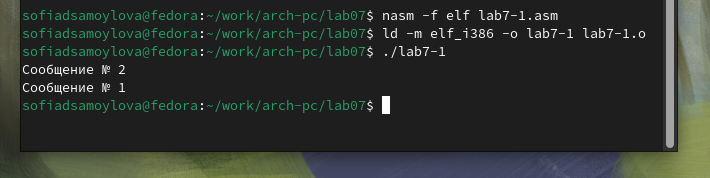{#fig:005 width=70%}

Изменяю текст программы, корректируя инструкции `jmp`, чтобы вывод программы был следующим (рис. [-@fig:007]):
```bash
user@dk4n31:~$ ./lab7-1
Сообщение № 3
Сообщение № 2
Сообщение № 1
user@dk4n31:~$
```
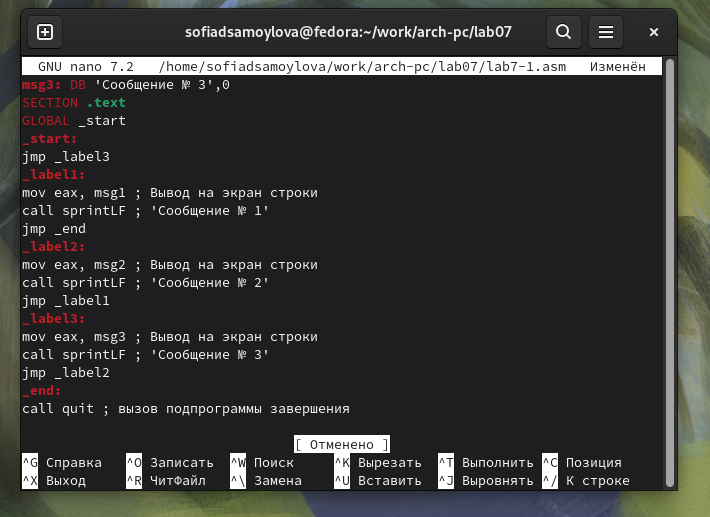{#fig:007 width=70%}

Создаю исполняемый файл и проверяю его работу (рис. [-@fig:008]).

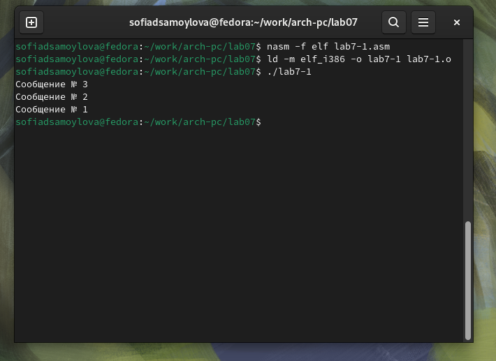{#fig:008 width=70%}

Создаю файл `lab7-2.asm` в каталоге `~/work/arch-pc/lab07`и ввожу код программы в `lab7-2.asm` (рис. [-@fig:009]).

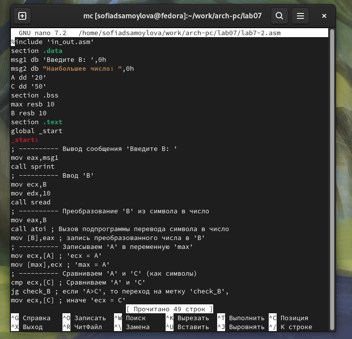{#fig:009 width=70%}

Создаю исполняемый файл и проверяю его работу для разных значений `В` (рис. [-@fig:012]).

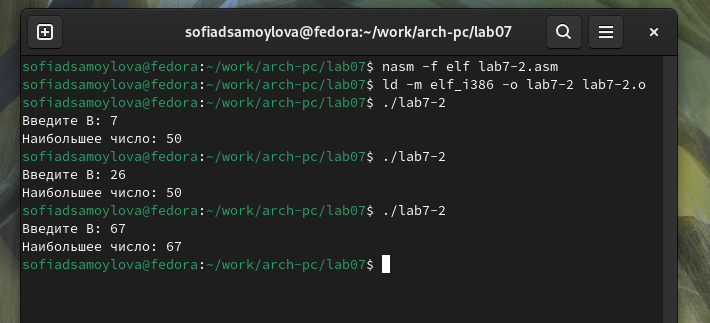{#fig:012 width=70%}

В данном примере переменные `A` и `С` сравниваются как символы, а переменная `B` и максимум из `A` и `С` как числа (для этого используется функция `atoi` преобразования символа в число). Это сделано для демонстрации того, как сравниваются данные.

## Изучение структуры файлы листинга

Обычно `nasm` создаёт в результате ассемблирования только объектный файл. Получить файл листинга можно, указав ключ `-l` и задав имя файла листинга в командной строке. Создаю файл листинга для программы из файла `lab7-2.asm` и открываю его с помощью `mcedit`(рис. [-@fig:013]).

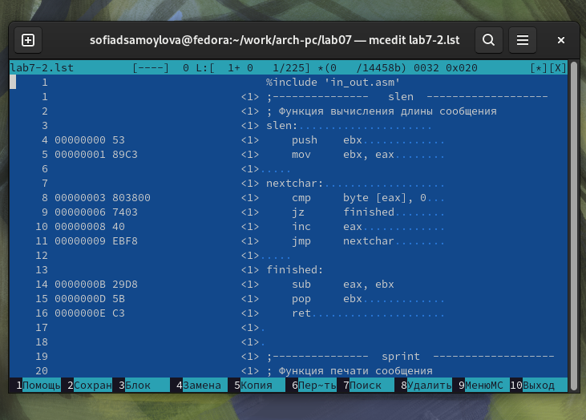{#fig:013 width=70%}

Первое значение в файле листинга - номер строки, и он может вовсе не совпадать с номером строки изначального файла. Второе вхождение - адрес, смещение машинного кода относительно начала текущего сегмента, затем непосредственно идет сам машинный код, а заключает строку исходный текст программы с комментариями.

Попробую изменить следующую строку:
```bash
cmp ecx,[C] ; Сравниваем 'A' и 'C'

```

Удалив один из операндов, изменяю её на:
```bash
cmp ecx ; Сравниваем 'A' и 'C'
```

`Последствия изменений`

1. Синтаксические ошибки: Удаление одного из операндов в инструкции сравнения `cmp` приведет к синтаксической ошибке, так как команда `cmp` требует два операнда (регистры или память).

2. Выходные файлы:

   • Если вы попытаетесь собрать программу с этой ошибкой, компилятор (или ассемблер) не сможет создать исполняемый файл, так как код будет содержать ошибку.

   • В случае успешной сборки (если исправить ошибку), будут созданы выходные файлы, такие как `.o` (объектный файл) и исполняемый файл (например, `a.out` или с другим именем, если вы укажете его).

Соответственно, не получится создать и скомпилировать файлы (рис. [-@fig:016]).

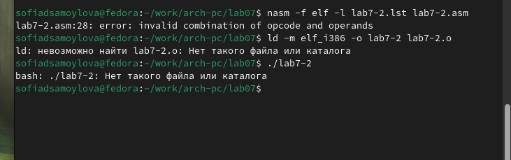{#fig:016 width=70%}

## Задание для самостоятельной работы

Вариант предыдущей лабораторной работы 17. 

*Задание 1* 
Код программы:
```bash
%include 'in_out.asm'

section .data
msg1 db 'Введите B: ', 0
msg2 db 'Наименьшее число: ', 0
A dd 26          ; Значение A
B dd 12          ; Значение B
C dd 68          ; Значение C

section .bss
min resd 1       ; Переменная для хранения наименьшего значения

section .text
global _start
_start:
    ; ---------- Начинаем с предположения, что A - наименьшее
    mov eax, [A]
    mov [min], eax    ; min = A

    ; ---------- Сравниваем min и B
    mov eax, [B]
    cmp eax, [min]
    jl update_min     ; Если B < min, обновляем min

    ; ---------- Сравниваем min и C
    mov eax, [C]
    cmp eax, [min]
    jl update_min     ; Если C < min, обновляем min

    jmp print_result   ; Переход к выводу результата

update_min:
    mov eax, [B]      ; Если один из предыдущих сравнений был истинным, обновляем min
    mov [min], eax

print_result:
    ; ---------- Вывод результата
    mov eax, msg2
    call sprint       ; Вывод сообщения 'Наименьшее число: '
    mov eax, [min]
    call iprintLF     ; Вывод 'min(A,B,C)'
    call quit         ; Выход
```

Результат работы программы (рис. [-@fig:019]).

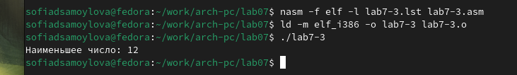{#fig:019 width=70%}

*Задание 2* 
Код программы:
```bash
%include 'in_out.asm'

section .data
msg1 db 'Введите x: ', 0
msg2 db 'Введите a: ', 0
msg3 db 'Результат f(x): ', 0
A dd 20          ; Значение A, не используется в данной задаче
C dd 50          ; Значение C, не используется в данной задаче

section .bss
result resb 10    ; Переменная для хранения результата
x resb 10         ; Переменная для хранения введенного x
a resb 10         ; Переменная для хранения введенного a

section .text
global _start
_start:
    ; ---------- Вывод сообщения 'Введите x: '
    mov eax, msg1
    call sprint
    
    ; ---------- Ввод 'x'
    mov ecx, x
    mov edx, 10
    call sread
    
    ; ---------- Преобразование 'x' из символа в число
    mov eax, x
    call atoi          ; Вызов подпрограммы перевода символа в число
    mov [x], eax       ; Запись преобразованного числа в 'x'
    
    ; ---------- Вывод сообщения 'Введите a: '
    mov eax, msg2
    call sprint
    
    ; ---------- Ввод 'a'
    mov ecx, a
    mov edx, 10
    call sread
    
    ; ---------- Преобразование 'a' из символа в число
    mov eax, a
    call atoi          ; Вызов подпрограммы перевода символа в число
    mov [a], eax       ; Запись преобразованного числа в 'a'
    
    ; ---------- Сравниваем 'a' с 8
    mov eax, [a]
    cmp eax, 8        ; Сравниваем a с 8
    jl case_a_less_8  ; Если a < 8, переходим к case_a_less_8

    ; Если a >= 8, вычисляем a * x
    mov eax, [a]
    mov ebx, [x]      ; Загружаем значение x в ebx
    imul eax, ebx     ; Умножаем a на x (eax = a * x)
    jmp store_result   ; Переход к сохранению результата

case_a_less_8:
    ; Если a < 8, вычисляем a + 8
    mov eax, [a]
    add eax, 8        ; eax = a + 8

store_result:
    mov [result], eax  ; Сохраняем результат в переменной result

    ; ---------- Вывод результата
    mov eax, msg3
    call sprint        ; Вывод сообщения 'Результат f(x): '
    
    mov eax, [result]
    call iprintLF      ; Вывод результата f(x)
    
    call quit          ; Выход
```
Результат работы программы (рис. [-@fig:020]).

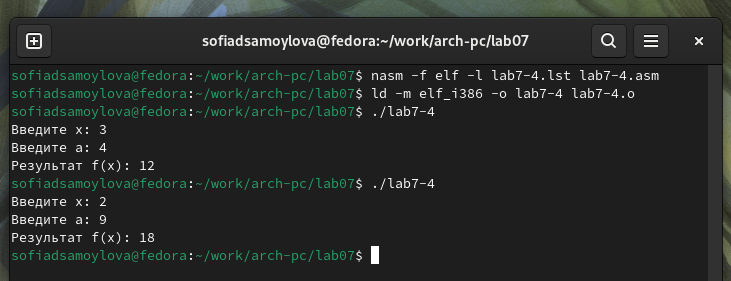{#fig:020 width=70%}


# Выводы

При выполнении лабораторной работы я изучила команды условных и безусловных переходов, а также приобрела навыки написания программ с использованием переходов, познакомилась с назначением и структурой файлов листинга.

