---
## Front matter
title: "Отчёт по лабораторной работе №8"
subtitle: "Дисциплина: Архитектура компьютера"
author: "Самойлова Софья Дмитриевна"

## Generic otions
lang: ru-RU
toc-title: "Содержание"

## Bibliography
bibliography: bib/cite.bib
csl: pandoc/csl/gost-r-7-0-5-2008-numeric.csl

## Pdf output format
toc: true # Table of contents
toc-depth: 2
lof: true # List of figures
fontsize: 12pt
linestretch: 1.5
papersize: a4
documentclass: scrreprt
## I18n polyglossia
polyglossia-lang:
  name: russian
  options:
	- spelling=modern
	- babelshorthands=true
polyglossia-otherlangs:
  name: english
## I18n babel
babel-lang: russian
babel-otherlangs: english
## Fonts
mainfont: IBM Plex Serif
romanfont: IBM Plex Serif
sansfont: IBM Plex Sans
monofont: IBM Plex Mono
mathfont: STIX Two Math
mainfontoptions: Ligatures=Common,Ligatures=TeX,Scale=0.94
romanfontoptions: Ligatures=Common,Ligatures=TeX,Scale=0.94
sansfontoptions: Ligatures=Common,Ligatures=TeX,Scale=MatchLowercase,Scale=0.94
monofontoptions: Scale=MatchLowercase,Scale=0.94,FakeStretch=0.9
mathfontoptions:
## Biblatex
biblatex: true
biblio-style: "gost-numeric"
biblatexoptions:
  - parentracker=true
  - backend=biber
  - hyperref=auto
  - language=auto
  - autolang=other*
  - citestyle=gost-numeric
## Pandoc-crossref LaTeX customization
figureTitle: "Рис."
lofTitle: "Список иллюстраций"
## Misc options
indent: true
header-includes:
  - \usepackage{indentfirst}
  - \usepackage{float} # keep figures where there are in the text
  - \floatplacement{figure}{H} # keep figures where there are in the text
---

# Цель работы

Целью лабораторной работы является приобретение навыков написания программ с использованием циклов и обработкой аргументов командной строки.

# Задание

Здесь приводится описание задания в соответствии с рекомендациями
методического пособия и выданным вариантом.

# Теоретическое введение

Стек — это структура данных, организованная по принципу *LIFO* (*«Last In — First Out»* или «последним пришёл — первым ушёл»). Стек является частью архитектуры процессора и реализован на аппаратном уровне. Для работы со стеком в процессоре есть специальные
регистры (`ss, bp, sp`) и команды.
Основной функцией стека является функция сохранения адресов возврата и передачи аргументов при вызове процедур. Кроме того, в нём выделяется память для локальных переменных и могут временно храниться значения регистров.

Стек имеет вершину, адрес последнего добавленного элемента, который хранится в регистре `esp` (указатель стека). Противоположный конец стека называется дном. Значение, помещённое в стек последним, извлекается первым. При помещении значения в стек указатель стека уменьшается, а при извлечении — увеличивается. Для стека существует две основные операции:

- добавление элемента в вершину стека (`push`);
- извлечение элемента из вершины стека (`pop`).


# Выполнение лабораторной работы
## Реализация циклов в NASM

Создаю каталог для программ лабораторной работы № 8, перехожу в него и создаю файл `lab8-1.asm`, дополнительно копирую в текущий каталог файл `in_out.asm` с помощью утилиты `cp`, т.к. он будет использоваться в других программах (рис. [-@fig:002]).

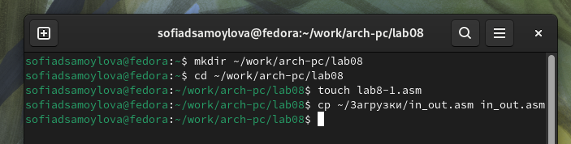{#fig:002 width=70%}

В качестве примера рассмотрю программу, которая выводит значение регистра `ecx`. Ввожу в файл `lab8-1.asm` текст программы (рис. [-@fig:003]).

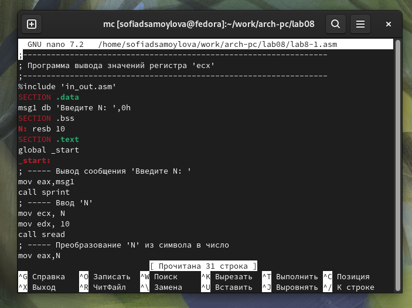{#fig:003 width=70%}

Создаю исполняемый файл и проверяю его работу (рис. [-@fig:004]).

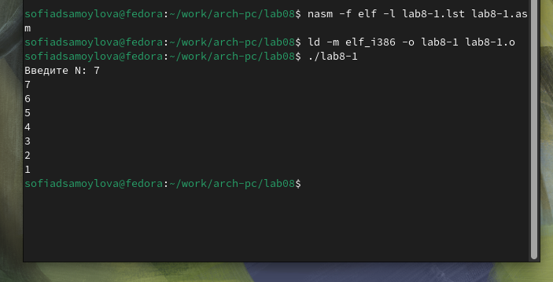{#fig:004 width=70%}

Программа показывает работу циклов в `NASM`.

Изменяю программу изначальную таким образом, что в теле цикла я изменяю значение регистра `ecx` (рис. [-@fig:005]).

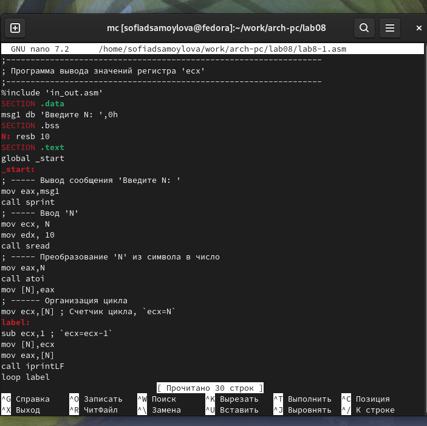{#fig:005 width=70%}

Как результат цикл программы стал бесконечным, несмотря на то, что значение для N было задано 5 (рис. [-@fig:006]).

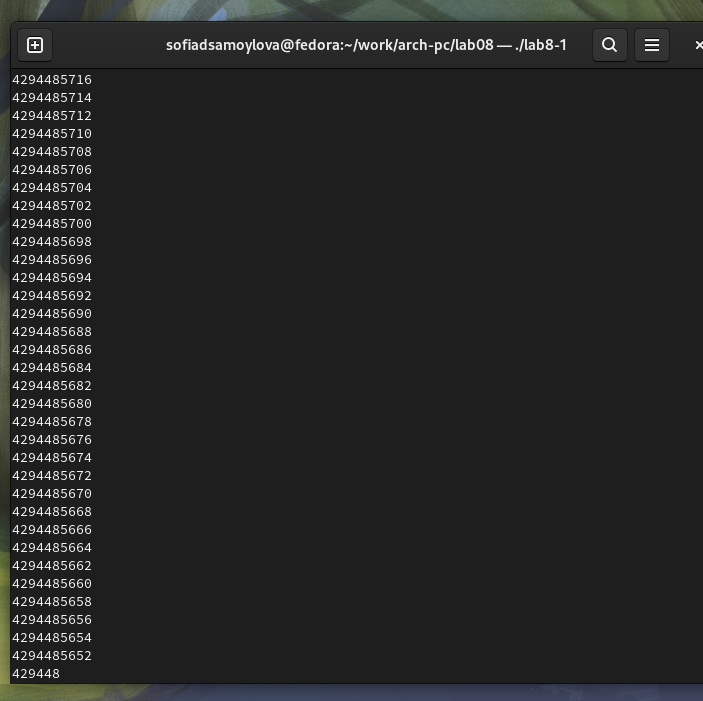{#fig:006 width=70%}

Для использования регистра `ecx` в цикле и сохранения корректности работы программы попробую использовать стек. Вношу изменения в текст программы добавив команды `push` и `pop` (добавления в стек и извлечения из стека) для сохранения значения счетчика цикла `loop`(рис. [-@fig:008]).

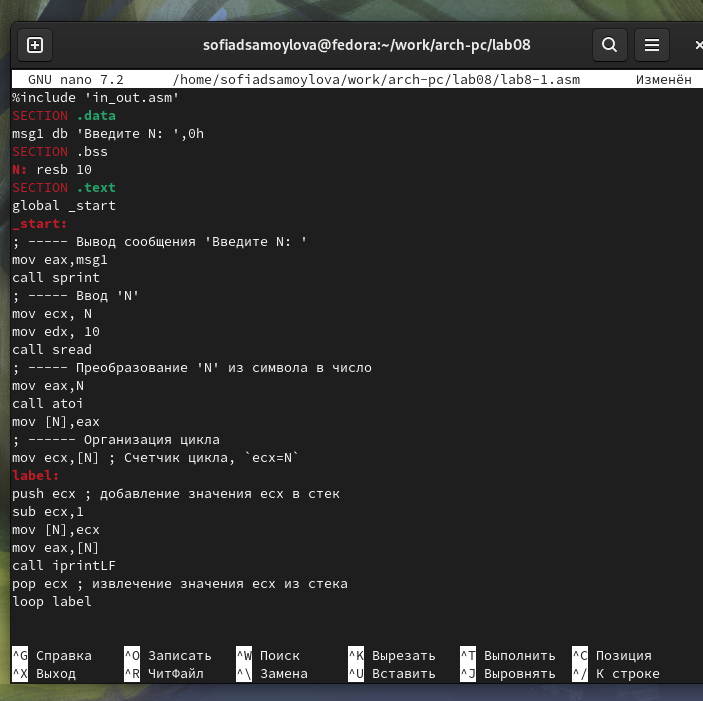{#fig:008 width=70%}

Создаю исполняемый файл и проверяю его работу (рис. [-@fig:009]).

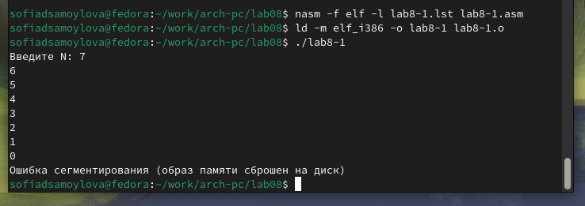{#fig:009 width=70%}

Число проходов по циклу соответствует значению `N`, с учетом 0.

## Обработка аргументов командной строки

Создаю файл `lab8-2.asm` в каталоге `~/work/arch-pc/lab08` и ввожу в него текст программы (рис. [-@fig:010]).

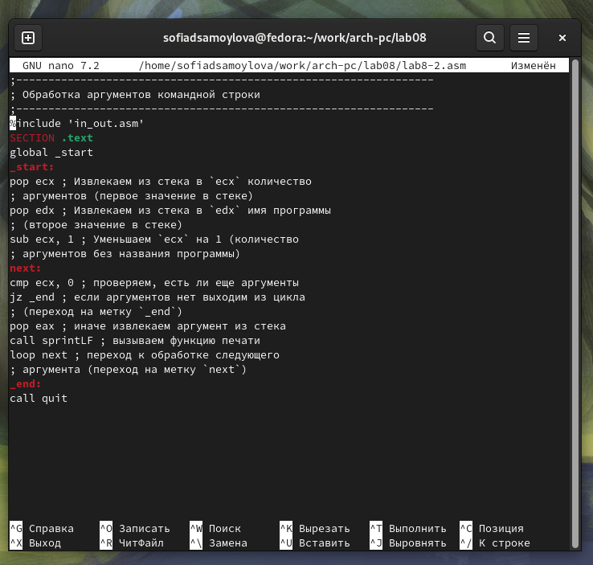{#fig:010 width=70%}

Запускаю его, указав аргументы (рис. [-@fig:011]).

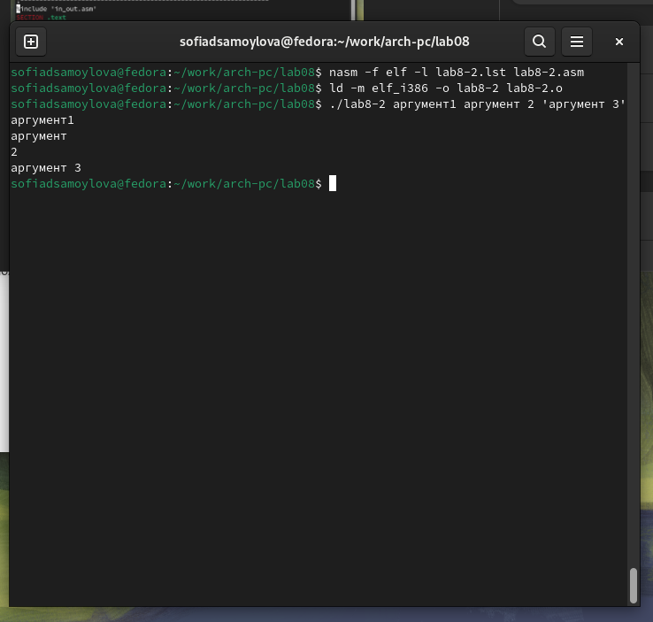{#fig:011 width=70%}

Все аргументы были обработаны программой.

Создаю файл `lab8-3.asm` в каталоге `~/work/archpc/lab08` и ввожу в него текст программы, которая выводит сумму чисел, которые передаются в программу как аргументы (рис. [-@fig:012]).

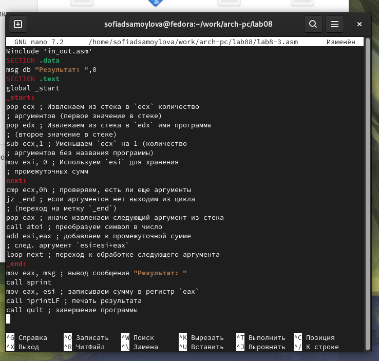{#fig:012 width=70%}

Создаю исполняемый файл и запускаю его, указав аргументы (рис. [-@fig:013]).

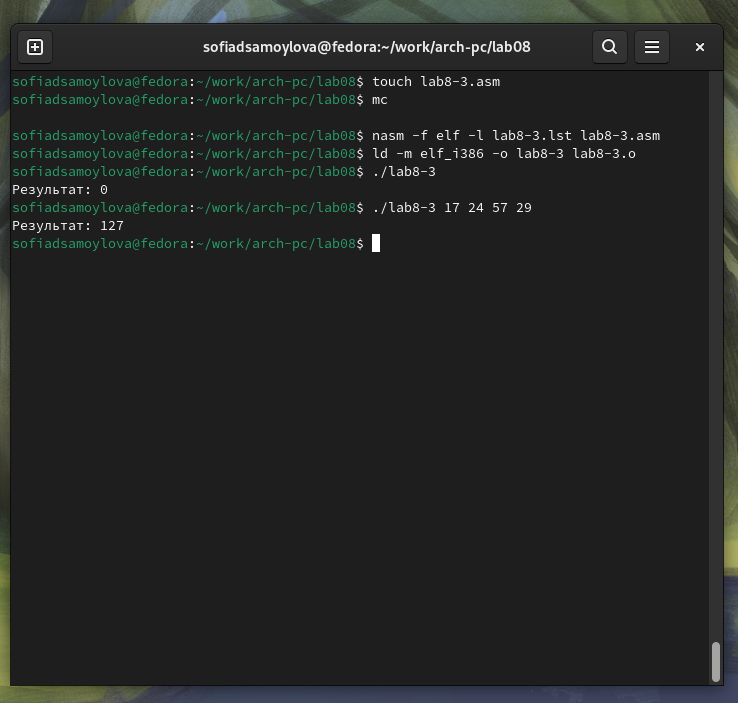{#fig:013 width=70%}

Изменяю текст программы для вычисления произведения аргументов командной строки (рис. [-@fig:014]).

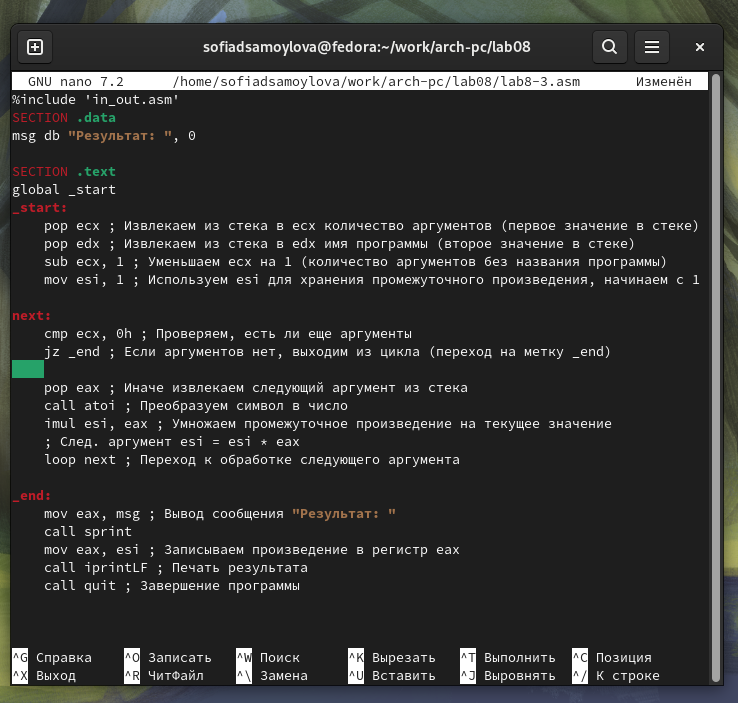{#fig:014 width=70%}

Проверяю работу программы (рис. [-@fig:015]).

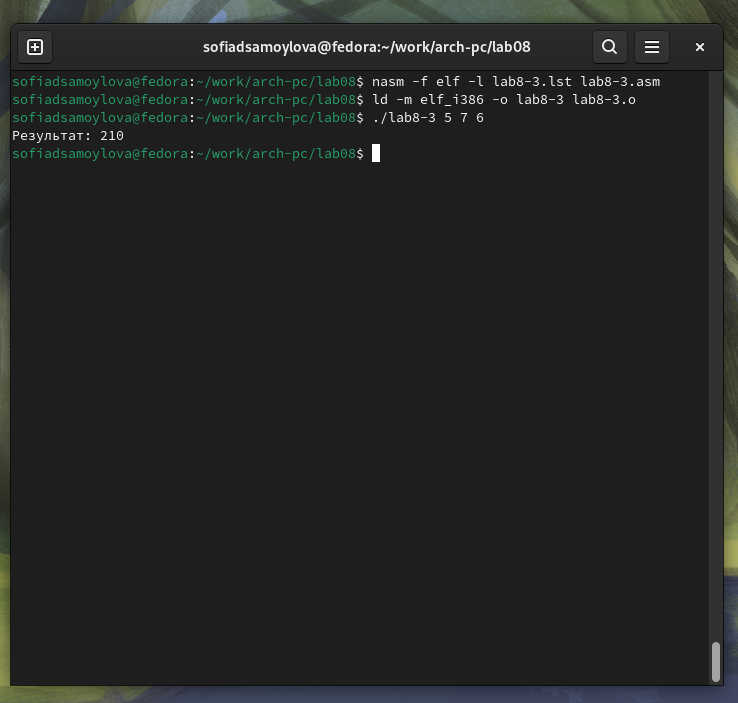{#fig:015 width=70%}

## Выполнение самостоятельной работы

Вариант задания номер 17.
Код программы:

```nasm
%include 'in_out.asm'
SECTION .data
msg_func db "Функция: f(x) = 10(x - 1)", 0
msg_result db "Результат: ", 0
SECTION .text
GLOBAL _start
_start:
    mov eax, msg_func
    call sprintLF
    pop ecx           ; Извлекаем количество аргументов
    pop edx           ; Извлекаем имя программы
    sub ecx, 1       ; Уменьшаем на 1, чтобы исключить имя программы
    mov esi, 0       ; Инициализируем сумму (esi) нулем

next:
    cmp ecx, 0h      ; Проверяем, есть ли еще аргументы
    jz _end          ; Если нет, переходим к окончанию

    pop eax          ; Извлекаем следующий аргумент
    call atoi        ; Преобразуем строку в число

    mov ebx, eax     ; Сохраняем значение x в ebx
    sub ebx, 1       ; Вычисляем (x - 1)
    mov eax, 10      ; Загружаем 10 в eax
    imul eax, ebx    ; Умножаем 10 на (x - 1)

    add esi, eax     ; Добавляем результат функции к сумме

    loop next        ; Переход к следующему аргументу
_end:
    mov eax, msg_result
    call sprint      ; Выводим сообщение "Результат: "
    mov eax, esi     ; Загружаем сумму в eax
    call iprintLF    ; Печатаем результат
    call quit        ; Завершаем программу
```
Результат работы программы (рис. [-@fig:016]).

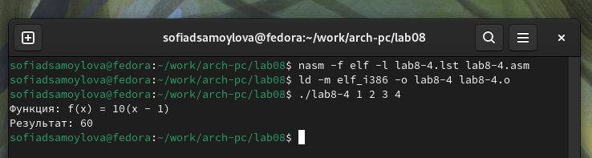{#fig:016 width=70%}

# Выводы

В результате выполнения данной лабораторной работы я приобрела навыки написания программ с использованием циклов, а также научилась обрабатывать аргументы командной строки.
